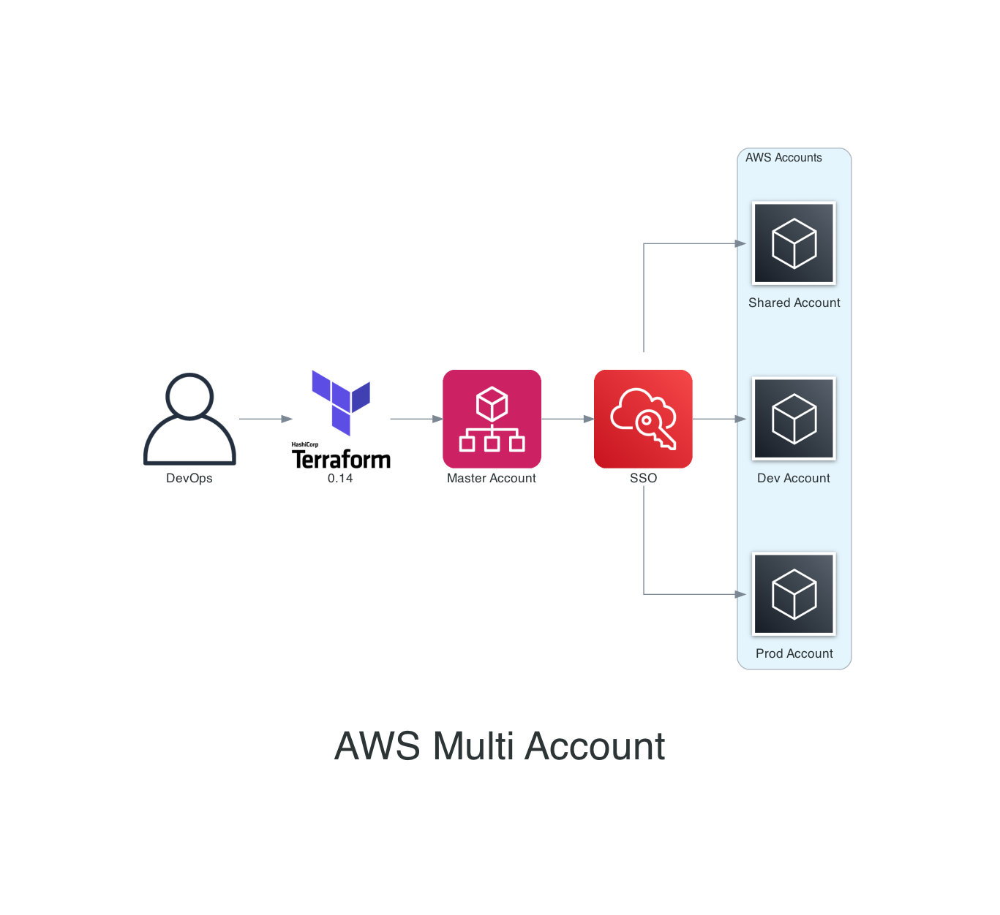

# AWS Multi Account Setup



## 0 - Install DevOps tools

!!! note "Action"
     [manual/local]

[Tools](../devops/tools.md)

## 1 - Create new IAM User for Terraform Ops

!!! note "Action"
     [manual/AWS Master Account]

:fontawesome-brands-aws: [https://console.aws.amazon.com/iam/](https://console.aws.amazon.com/iam/)

## 2 - Config aws-vault

!!! note "Action"
     [manual/local]

```bash
aws-vault add XYZ-master
```

## 3 - Terraform backend

!!! note "Action"
     [Terraform/local]

Bootstrap new AWS Accounts and creates Terraform Backend resources.

- Create repo: XYZ-terraform-backend
- repo clone
- Install dependencies

```bash
pre-commit install
tfenv install
```

- add master account folder
- use [terraform-aws-backend](../terraform/terraform-backend.md) module
- use Makefile for aws-vault
- use Makefile for TF ops

## 4 - Master Account => Organization and Accounts

!!! note "Action"
     [Terraform/local]

- Create repo: XYZ-terraform-master
- repo clone
- Install dependencies

```bash
pre-commit install
tfenv install
```

- use [terraform-aws-organization](../terraform/terraform-organization.md) module
- add OUs and Accounts
- add service access principals: SSO
- use Makefile for aws-vault
- use Makefile for TF ops

## 5 - Master Account - Enable SSO

!!! note "Action"
     [Master Account/Manual]

Enable SSO using AWS Console

:fontawesome-brands-aws: [https://console.aws.amazon.com/sso/](https://console.aws.amazon.com/sso/)

## 6 - Master Account - Create Users and Groups in SSO

!!! note "Action"
     [Master Account/Manual]

Create SSO groups and users

:fontawesome-brands-aws: [https://console.aws.amazon.com/sso/](https://console.aws.amazon.com/sso/)

## 7 - Master Account - SSO Permissions

!!! note "Action"
     [CloudFormation/local]

Since AWS SSO is not yet supported with Terraform, Use CFN to configure SSO Permission sets and Assignments.

- update sso cfn template
- Run Terraform apply.

## 8 - Master Account - Route53

!!! note "Action"
     [Terraform/local]

Create Route53 top level domain `example.com`. Migrate old zone if exist.

## 9 - Shared Account - Terraform Ops IAM Role
