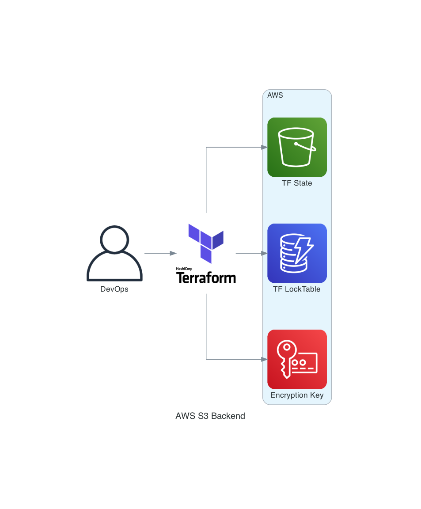

# terraform-aws-backend

=== "Github"
    **:fontawesome-brands-github: @mhmdio/terraform-aws-backend**

=== "Terraform Registry"
    **[mhmdio/backend/aws/latest](https://registry.terraform.io/modules/mhmdio/backend/aws/latest)**

This Repo is used to bootstrap new AWS account, and prepare them to be used with Terraform.
Creates:

- backend S3 bucket
- DynamoDB table
- KMS key

for managing Terraform state.

## Diagram



## Perquisites

```bash
aws-vault add x-master
git clone REPO_URL
cd REPO_PATH
pre-commit install
tfenv install
```

## Terraform Ops

Add Target Account block in Makefile.

```bash
make bootstrap-master
```
